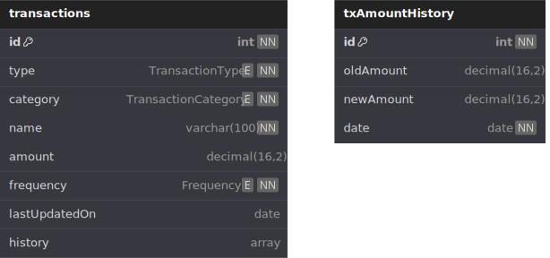

# BudgeTrack app

This app tracks monthly budget items

## Schema



## Schema Definition (DBML)

```dbml
Project budgetrack {
  database_type: 'MongoDB'
  Note: 'Construction Project Loan Analysis component'
}

Table transactions {
  id int [pk, unique, increment, not null]
  type TransactionType [not null]
  category TransactionCategory [not null]
  name varchar(100) [not null]
  amount decimal(16, 2)
  frequency Frequency [not null]
  lastUpdatedOn date
  history array
  Note: 'TX history is stored in an array structured like txAmountHistory'
}

Enum TransactionType {
  bill
  ccPayment
  loanPayment
  income
  savingsTransfer
  investmentTransfer
  variableExpense
}

Enum Frequency {
  1m
  1y
  6m
}

Enum TransactionCategory {
  needs
  wants
  savings
}

Table txAmountHistory {
  id int [pk, unique, increment, not null]
  oldAmount decimal(16, 2)
  newAmount decimal(16, 2)
  date date [not null]
}
```
